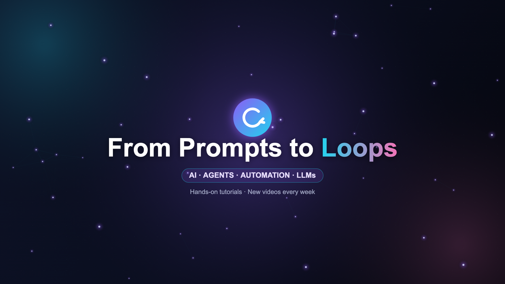

<div align="center">



# From Prompts to Loops

**AI · Agents · Automation · LLMs**

Hands-on notes, diagrams, and code — paired with every video on the channel.

[](https://www.youtube.com/@FromPromptstoLoops)
[](LICENSE)

</div>

---

## What is this repo?

Every video on the [From Prompts to Loops](https://www.youtube.com/@FromPromptstoLoops) YouTube channel has a matching folder here. Each folder contains:

- **Notes** — the written concepts from the video, cleaned up and readable without watching
- **Diagrams** — sketches and visuals referenced in the session
- **Code** — any notebooks or scripts shown or built during the video (where applicable)
- **Resources** — links to papers, tools, and further reading

> The notes are designed to *complement* the videos, not replace them. Watch the video first, then use the notes to review, copy snippets, or go deeper.

---

## How to best use this

**If you are just starting out:**
Follow the chapters in order — each video builds on the last. Start at `00` and work down. Don't skip the ML foundations (chapters 02–05) even if they look math-heavy; the explanations here are written to be approachable.

**If you already know the basics and want a specific topic:**
Jump straight to the chapter you need using the table below. Each folder is self-contained with its own README.

**If you are building something:**
Chapters `09`, `10`, `11`, `12`, and `13` are the most directly applicable to building real AI systems. The code notebooks in those chapters are ready to run.

**If you want to go deep:**
Each chapter README has a "Go Deeper" section with links to the original papers and tools referenced in the video.

---

## Course Curriculum

> ⭐ = video includes code / live build

| # | Video | Topics | Code |
|---|-------|---------|------|
| 00 | [10 AI Concepts Every Beginner Must Know](00-quick-overview/) | LLMs, RAG, Agents, Evals — the 30-min map | |
| 01 | [LLMs 101](01-llm-fundamentals/) | Model types, open weights, APIs, parameters | |
| 02 | [ML & Neural Networks — Part 1](02-ml-neural-networks-part1/) | How machines learn, loss, gradient descent | |
| 03 | [ML & Neural Networks — Part 2](03-ml-neural-networks-part2/) ⭐ | Inside a neural network, with code | ✓ |
| 04 | [Transformers — Part 1](04-transformers-part1/) | Tokens, embeddings, attention mechanism | |
| 05 | [Transformers — Part 2](05-transformers-part2/) ⭐ | Q/K/V, softmax, attention by hand | ✓ |
| 06 | [Inside an LLM Training Run](06-llm-training-internals/) | Ablations, evals, data prep, post-training | |
| 07 | [Fine-Tuning LLMs on Your Own Data](07-finetuning/) ⭐ | LoRA, QLoRA, PEFT, with code | ✓ |
| 08 | [RAG — Part 1](08-rag-part1/) ⭐ | Chunking, embeddings, vector DBs | ✓ |
| 09 | [RAG — Part 2: Build a RAG Chatbot](09-rag-part2-build/) ⭐ | LangChain, FAISS, OpenAI end-to-end | ✓ |
| 10 | [How Vector Databases Actually Work](10-vector-databases/) ⭐ | Indexing, ANN, HNSW | ✓ |
| 11 | [AI Agents — Part 1](11-ai-agents-part1/) ⭐ | LLMs, tool-use, the agentic loop, ReAct | ✓ |
| 12 | [Agentic Systems — Part 2](12-agentic-systems-part2/) ⭐ | MCP, multi-agents, memory | ✓ |
| 13 | [AI Evals Explained](13-evals-and-production/) ⭐ | Metrics, LLM-as-a-judge, monitoring | ✓ |

---

## Repo Structure

Every chapter has the same three sections:

```
FromPromptsToloops/
├── README.md                        ← you are here
├── 01-llm-fundamentals/
│   ├── README.md                    ← chapter overview and key concepts
│   ├── notes/
│   │   └── README.md                ← written notes, diagrams, cheatsheets
│   ├── code/
│   │   └── README.md                ← notebooks and scripts
│   └── resources/
│       └── README.md                ← papers, blogs, tools, docs
├── 02-ml-neural-networks-part1/
│   ├── ...same structure...
...
├── assets/
│   └── banner.png
├── CONTRIBUTING.md
└── LICENSE
```

| Folder | What goes in it |
|--------|----------------|
| `notes/` | Written concepts from the video — diagrams, cheatsheets, deeper explanations |
| `code/` | Jupyter notebooks and scripts — all runnable on Google Colab |
| `resources/` | Papers, blog posts, tools, and docs for going deeper on the topic |

Notebooks are runnable on [Google Colab](https://colab.research.google.com) with no local setup — look for the "Open in Colab" badge at the top of each notebook.

---

## Prerequisites

No prior AI/ML experience needed to start. To run the code notebooks you'll need:

- A free [Google Colab](https://colab.research.google.com) account, **or** Python 3.10+ locally
- An [OpenAI API key](https://platform.openai.com) for chapters that call the API (chapters 09, 11, 12, 13)
- For local model chapters: [Ollama](https://ollama.ai) installed (covered in chapter 01)

All Python dependencies are listed at the top of each notebook with `pip install` commands included.

---

## Contributing / Corrections

Found a mistake in the notes? Have a better diagram? Want to add a code example?

1. Open an issue describing what's wrong or what you'd like to add
2. Fork the repo, make your change, and open a pull request against `main`
3. Keep PRs scoped to one chapter at a time

All contributions are welcome — especially corrections to the math sections.

---

## Stay Updated

New videos drop every week. Star the repo to get notified when new chapter folders are added.

[](https://www.youtube.com/@FromPromptstoLoops)

---

<div align="center">
<sub>Made with curiosity. Notes by Ankit Khowal.</sub>
</div>
